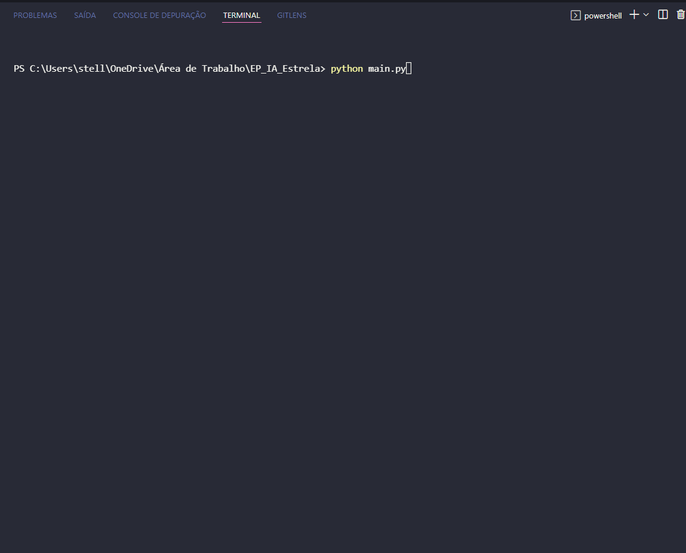

<h1 align="center"<strong> A*: Josenildo, o aventureiro 🧗 </strong></h1>

<h2 align="center"><strong>Descrição do projeto / Tecnologias Usadas</strong></h2>

<strong>Projeto criado para o curso de Ciência da Computação - IA </strong> 
Josenildo é um profissional de tecnologia aventureiro que gosta de esportes de natureza. Ele gosta de desafio de travessia na natureza hostil, passando por rios, deserto, montanhas e tudo mais para chegar aos seus objetivos.

Josenildo está em uma competição contra o relógio e precisa ser rápido na sua travessia, travessando um desafio dado. Como estudou Inteligência Artificial no SENAC, percebeu que a busca A* é a melhor técnica para conseguir planejar o seu traçado.

O que Josenildo irá receber: O mapa montado com todos os desafios até o seu destino.

Cada quadrado é uma representação do terreno:

Quadrado de terra: esforço de  1 ponto
Quadrado de água: esforço de 3 pontos
Quadrado de areia movediça: esforço de 6 pontos
Quadrado de barreira: intransponíveis

Ela irá terá um ponto inicial e um ponto objetivo no seu mapa.

O que Josenildo deverá desenvolver:

Função de movimentos sucessores
Função de teste de sucesso
Função que define a heurística até o seu destino
Função de custo
Função A*

A função A* deverá retornar o caminho mais rápido que Josenildo deverá fazer. Como é feito por quadrados, os movimentos permitidos são: CIMA, BAIXO, ESQUERDA, DIREITA, CIMA-DIREITA, CIMA-ESQUERDA, BAIXO-DIREITA e BAIXO-ESQUERDA.
  
Usamos o Python 🐍 como linguagem com o auxilio de algumas libs.

<h2 align="center"><strong>Feito por:</strong></h2>
  Daniel Bortoleti Melo, Stella Rufino, Mayara Rosa

<h2 align="center"><strong> Execução :</strong></h2>

Vídeo/Explicação 🎥:   

